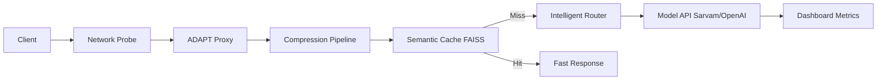

# ADAPT — Adaptive AI QoS Infrastructure

## The Pitch

> "AI should degrade gracefully, not catastrophically."

ADAPT is a next-generation infrastructure layer designed for the "Next Billion Users." While Silicon Valley builds for fiber and 5G, ADAPT makes AI survive—and thrive—on 2G networks, ₹5,000 phones, and ₹5-per-1K-token budgets. 

When the network drops, ADAPT doesn't give up. It summarizes, compresses, routes to smaller models, and leverages high-performance semantic caching to maintain continuity.

## 🚀 "Holy Shit" Demo

**Scenario: User on a moving train in rural India.**
Network fluctuates between WiFi, 4G, and 2G.

| Event | Network | Action | Tokens | Cost | Latency |
|-------|---------|--------|--------|------|---------|
| 1. Query | WiFi    | Full Model (30B+) | 2,400 | ₹12.00 | 4.2s |
| 2. Query | 4G      | Light Compression (7B) | 1,850 | ₹5.55 | 2.1s |
| 3. Query | 2G      | **Survival Mode (1B)** | 890 | ₹0.45 | 1.8s |
| 4. Repeat| 2G      | **Semantic Cache Hit** | 52 | ₹0.00 | 0.3s |

**Outcome**: The user stays engaged. The conversation never crashes. The cost drops by 90% when conditions worsen.

## ✨ Key Features

### 1. 📦 Multi-Layer Compression Pipeline
- **Layer 1 (Semantic)**: Summarizes conversation history beyond 5 turns.
- **Layer 2 (Token-level)**: Aggressive abbreviation (e.g., "Registration" → "Reg") and filler removal.
- **Layer 3 (Context Pruning)**: Prunes non-essential context while maintaining core intent.
- **Multilingual**: Optimized for Indic scripts (2 chars/token) and Hinglish/code-mixed input.

### 2. ⚡ High-Performance Semantic Caching
- **Engine**: FAISS (Facebook AI Similarity Search) + MiniLM-L6-v2 embeddings.
- **Threshold**: 0.92 cosine similarity for high-precision matches.
- **Performance**: 0 tokens, 0 cost, and sub-100ms response for repetitive or "near-duplicate" queries.

### 3. 📡 Intelligent Hysteresis Routing
- **Network-Aware**: Real-time QoS probing (bandwidth & latency).
- **Hysteresis**: Prevents "network flapping" using rolling averages and stability thresholds.
- **Model Tiers**:
  - **WiFi**: Llama 3.3 70B Versatile
  - **4G**: Llama 3.1 70B Versatile
  - **3G**: Llama 3.1 8B Instant
  - **2G**: Llama 3.1 8B Instant

### 4. 📊 Live Adaptation Dashboard
- **Premium UI**: Glassmorphism aesthetic with real-time WebSocket updates.
- **Metrics**: Cost tracking in ₹, token reduction ratios, and adaptation event logs.
- **Network Simulator**: Test how the system reacts to signal drops with a single click.

## 🛠️ Technical Architecture



## 🏗️ Technical Deep Dive

### Why FAISS?
Traditional key-value caches fail in AI because users never ask the same question exactly the same way. ADAPT uses FAISS to find *semantically* similar questions in vector space. This is critical for 2G users where every bit counts.

### Multilingual Continuity
ADAPT detects Indic script density. Since Indic characters can be token-heavy, we apply specialized compression to Hindi/Tamil content, reducing the "token-tax" for Indian users.

### Hysteresis Routing
Switching models too frequently (flapping) destroys user experience. ADAPT requires 3 consistent network readings before triggering a model tier change, ensuring a stable "quality of service."

## 🛠️ Installation & Setup

```bash
# Clone and enter
git clone https://github.com/hasan-raja/adapt
cd adapt

# Backend Setup
python -m venv .venv
source .venv/bin/activate # or .venv\Scripts\activate on Windows
pip install -r requirements.txt
uvicorn app.main:app --reload

# Frontend Setup
cd frontend
npm install
npm run dev
```

## 📜 Philosophy
> "Build for the 500M Indians on 2G, not just the 50M on fiber."

ADAPT is built on the belief that access to intelligence should be a right, not a luxury dependent on your proximity to a cell tower.

---
**Submission for Sarvam AI / Activate Fellowship**
Built with ❤️ for the Next Billion Users.