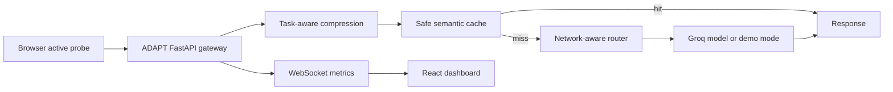

# ADAPT - Adaptive AI QoS Infrastructure

> AI should degrade gracefully, not catastrophically.

ADAPT is an AI QoS gateway for low-connectivity users. It keeps LLM apps usable when network quality drops by measuring client conditions, compressing context, routing to an appropriate model tier, and serving safe semantic-cache hits for repeated general questions.

Built as a fellowship prototype for India-first AI infrastructure.

## Why this exists

Most AI apps assume stable connectivity, modern phones, and enough budget to call a large model every time. That is not always true for rural, mobile-first, or cost-sensitive users. ADAPT explores a different default: the answer may become shorter under bad network conditions, but the app should not simply fail.

## Architecture



## What is implemented

- Active browser probe endpoints: `/network/ping` and `/network/probe-payload`.
- Network tier selection from active probe hints, browser hints, or manual demo controls.
- Hysteresis tier stabilization to avoid network flapping.
- Request-boundary model routing by network tier and task type.
- Conversation history compression before model calls.
- Session memory using `session_id`, so continuity survives model switches.
- FAISS + MiniLM semantic cache with exact-match fallback.
- Safety policy that skips semantic cache reuse for health, finance, identity, OTP, PIN, and credential prompts.
- SSE foundation endpoint at `/adapt/stream`.
- Live React dashboard with network controls, active probe, trace output, cache stats, and cost/token metrics.

## What is still prototype/demo

- Manual 2G/3G/4G/WiFi buttons are demo controls, not real packet throttling.
- Mid-response network switching is not fully implemented yet. ADAPT currently adapts before each request.
- If `GROQ_API_KEY` is absent, responses use transparent demo text.
- Benchmark numbers in the dashboard are estimates until rerun against the eval set.

See [EVALUATION.md](./EVALUATION.md) and [benchmarks/results.md](./benchmarks/results.md) for the exact claim boundary.

## Quick Start

```bash
# Clone and enter
git clone https://github.com/hasan-raja/adapt
cd adapt

# Backend Setup
python -m venv .venv
source .venv/bin/activate # or .venv\Scripts\activate on Windows
pip install -r requirements.txt
uvicorn app.main:app --reload
```

In another terminal:

```bash
cd frontend
npm install
npm run dev
```

Open the dashboard at `http://localhost:3000`.

## Environment Variables

```bash
GROQ_API_KEY=your_key_here
```

If no Groq key is configured, ADAPT stays runnable in demo mode.

## Demo Script

1. Open the dashboard.
2. Click `Run Active Browser Probe`.
3. Ask a general question on WiFi.
4. Switch to 2G and ask a public-service question.
5. Ask a similar non-sensitive question again to show semantic cache behavior.
6. Ask a UPI/PIN/health prompt to show safe cache skip.
7. Point to the trace chips: network tier, compression, task type, model, cache policy.

## Evaluation

Use [eval_prompts.json](./eval_prompts.json) for Hinglish, public-service, agriculture, health, education, and financial-safety prompts.

Run the live eval set after starting the backend:

```bash
python scripts/run_eval.py
```

Save a JSON artifact:

```bash
python scripts/run_eval.py --output eval_results.json
```

Core tests:

```bash
python -m unittest discover tests
```

## One-line Pitch

ADAPT is an AI QoS gateway that keeps LLM apps usable when network quality collapses.
